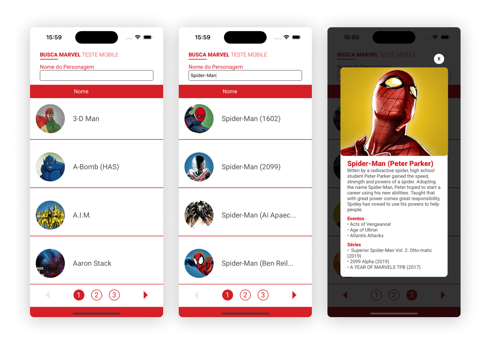

# Hero Mobile App
> React Native application for listing Marvel superheroes!



## How to start

These instructions will show you how to make a copy of this project and run it locally in a development environment:

### Prerequisites

- [Marvel API Key and Hash](https://developer.marvel.com/documentation/authorization) to make the requests to the Marvel characters API;

- [React Native environment](https://reactnative.dev/docs/getting-started) with iOS and/or Android build;

### Installation

Clone the repository:

```
git clone https://github.com/luisabfs/hero-mobile.git
```

Initialize the dependencies in `node_modules`:

```
yarn install
```

Create a file called `.env` in the root of the project and add your API key:

```env
API_KEY=YOURAPIKEY
API_HASH=YOURAPIHASH
```

Start and build the app:

```
yarn start
yarn ios // or yarn android
```

Run tests:
```
yarn test
```

## Built with

* [Axios](https://github.com/axios/axios) - HTTP client based on Promises for the API calls;
* [Styled Components](https://github.com/styled-components/styled-components) - CSS-in-JS for styling React components;
* [Jest and React Native Testing Library](https://github.com/callstack/react-native-testing-library) - for automated unit tests;
* [Axios Mock Adapter](https://github.com/ctimmerm/axios-mock-adapter) - Axios adapter that allows to easily mock requests;
* [React Native Dotenv](https://github.com/goatandsheep/react-native-dotenv) - for loading environment variables using import statements;
